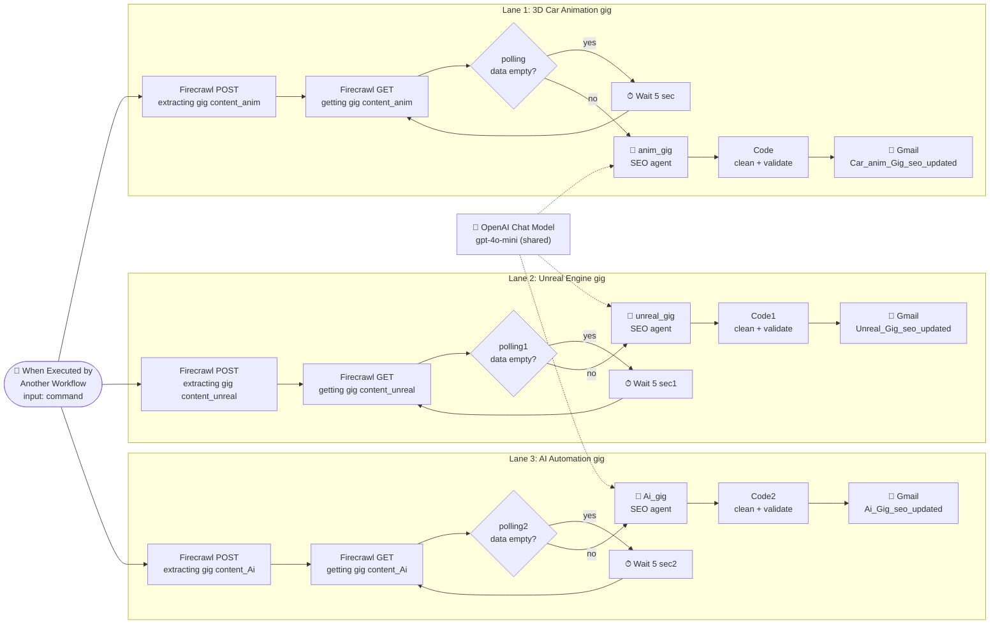
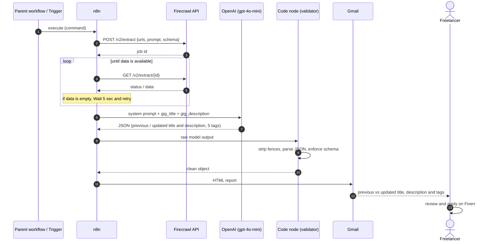
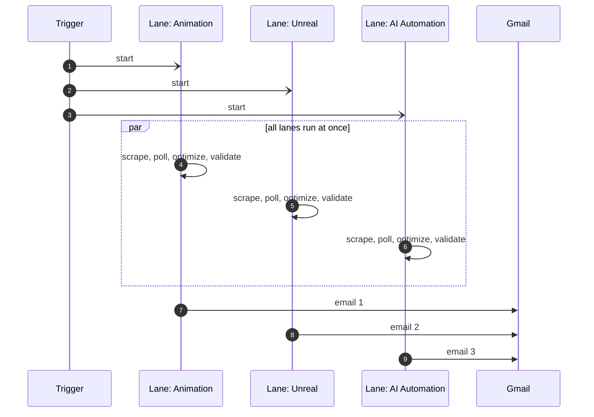
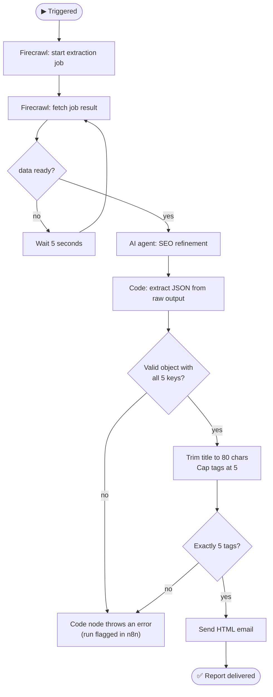
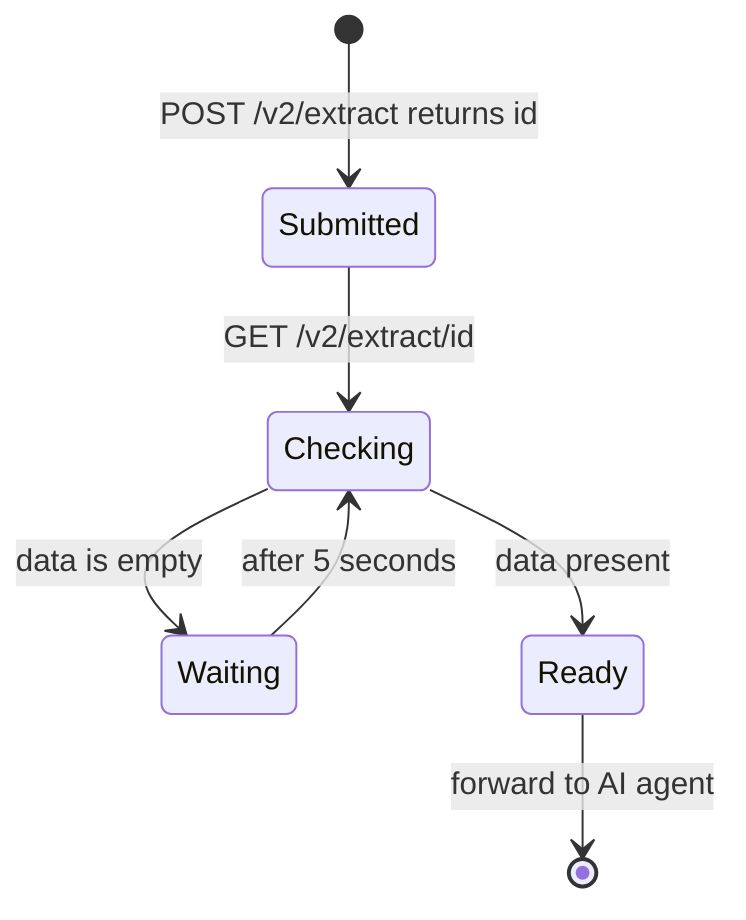

<div align="center">

# 🔍 SEO Department: AI-Powered Fiverr Gig Optimization Automation

**Point it at a Fiverr gig. It scrapes the live listing, rewrites the title, description and tags for search, and emails you a clean before-and-after report.**


</div>

---

## 📝 Descriptions

**Repo tagline (100 characters):**

> AI n8n workflow: scrapes a Fiverr gig, rewrites title, description and tags for SEO, emails results.

**Short description (100 words):**

> An n8n automation that acts as a Fiverr SEO department. Given a gig, it scrapes the live title and description with Firecrawl, waits until the extraction finishes, then hands the text to an OpenAI agent that improves keywords without changing the gig's meaning. A code step validates the JSON, enforces the 80-character title limit and exactly five tags, and an HTML email delivers a clear before-and-after comparison. Three lanes run in parallel for 3D animation, Unreal Engine and AI automation gigs, so freelancers optimize every listing in just minutes instead of researching keywords manually, with no manual copy-pasting between tools.

---

## 📑 Table of Contents

1. [The Big Problem This Solves](#-the-big-problem-this-solves)
2. [What Happens When It Runs](#-what-happens-when-it-runs)
3. [Tech Stack](#-tech-stack)
4. [Two Versions of the Workflow](#-two-versions-of-the-workflow)
5. [System Architecture](#-system-architecture)
6. [The Full Automation, Stage by Stage](#-the-full-automation-stage-by-stage)
7. [End-to-End Sequence Diagrams](#-end-to-end-sequence-diagrams)
8. [The Async Polling Loop](#-the-async-polling-loop)
9. [The AI Optimization Contract](#-the-ai-optimization-contract)
10. [The Validation Layer](#-the-validation-layer)
11. [The Email Report](#-the-email-report)
12. [Setup Guide](#-setup-guide)
13. [Production-Readiness Checklist](#-production-readiness-checklist)
14. [Roadmap](#-roadmap)
15. [Full Automation in One Minute](#-full-automation-in-one-minute)
16. [Author](#-author)

---

## 🔥 The Big Problem This Solves

On Fiverr, **search ranking decides who gets orders**. A gig's title, description and five tags are what the marketplace (and Google) use to match a listing to a buyer's search. Most freelancers write those once, at launch, and never touch them again.

Optimizing a listing properly means, for **every gig**:

- opening the live gig and copying the current title and description
- researching how real buyers phrase their searches
- rewriting the text so keywords appear naturally, without changing what the gig actually offers
- choosing five tags that fit
- keeping the title inside Fiverr's character limit
- doing all of that again for the next gig, and the next

That is repetitive, time-consuming and inconsistent, especially for a freelancer running several gigs in different niches (in this project: 3D car animation, Unreal Engine, and AI automation).

### ✅ What this project fixes

| Pain point (before) | Solution (after) |
|---|---|
| Copy-pasting gig text by hand | Firecrawl scrapes the live title and description automatically |
| Keyword research and rewriting for each gig | An OpenAI agent refines the text with SEO in mind, staying faithful to the original meaning |
| Inconsistent output from ad-hoc prompting | A fixed system prompt and a fixed JSON schema for every gig |
| Broken or over-long AI output | A code step cleans the JSON, trims the title to 80 characters and guarantees exactly 5 tags |
| Optimizing gigs one at a time | Three gig lanes run **in parallel** from a single trigger |
| No clear view of what changed | An HTML email shows previous vs updated title and description plus the new tags |

> **In one line:** it turns *"I should really optimize my gigs someday"* into *an automated pipeline that delivers ready-to-paste SEO improvements to your inbox*.

---

## ⚡ What Happens When It Runs

1. **A trigger fires.** The workflow is designed to be called by another workflow (an "SEO department" that a parent automation or agent can invoke).
2. **Three lanes start at the same time**, one per gig: 3D car animation, Unreal Engine, AI automation.
3. **Each lane asks Firecrawl to scrape its gig page** and extract two things: `gig_title` and `gig_description`.
4. **Firecrawl works asynchronously**, so the workflow checks the job repeatedly, pausing 5 seconds between checks, until the data is ready.
5. **An OpenAI agent** (`gpt-4o-mini`) acts as a Fiverr SEO expert. It adjusts keywords in the existing title and description and produces exactly five tags.
6. **A JavaScript node cleans and validates** the model's answer, whatever shape it arrives in.
7. **Gmail sends an HTML report** with previous and updated title, previous and updated description, and the five tags. One email per gig.
8. **You review and apply** the changes to your gig on Fiverr.

**Workflow footprint:** 28 nodes: 23 functional plus 5 documentation sticky notes. That is 1 trigger, 6 HTTP requests, 3 polling IFs, 3 Wait nodes, 3 AI agents sharing 1 OpenAI model, 3 Code nodes and 3 Gmail nodes.

---

## 🧰 Tech Stack

| Layer | Technology | Role |
|---|---|---|
| Orchestration | **n8n** | Runs the whole pipeline |
| Entry point | **Execute Workflow Trigger** (input field: `command`) | Lets a parent workflow invoke this one |
| Web scraping | **Firecrawl v2 `/extract`** (async job API) | Pulls gig title and description into a defined schema |
| AI | **OpenAI `gpt-4o-mini`** via n8n LangChain Agent | SEO refinement and tag generation |
| Validation | **JavaScript (Code nodes)** | Robust JSON parsing and schema enforcement |
| Delivery | **Gmail (OAuth2)** | HTML before-and-after report |

---

## 🧭 Two Versions of the Workflow

The project ships as two n8n canvases (see the screenshots in the repo):

| | **Single-gig version** | **Multi-gig version** (the exported JSON) |
|---|---|---|
| Trigger | Manual: *When clicking "Execute workflow"* | *When Executed by Another Workflow* |
| Lanes | 1 (`anim_gig`) | 3 (`anim_gig`, `unreal_gig`, `Ai_gig`) |
| Best for | Building, testing and tuning the logic | Running all gigs at once, callable by other automations |

Both share the same four zones, colour-coded on the canvas: 🔵 **trigger**, 🟢 **scraping gig content**, 🔴 **refining content**, 🟠 **sending updated content**.

---

## 🏗 System Architecture



The three lanes are **structurally identical**. They differ only in node names, the email subject and the email heading. One trigger fans out to all three, and they run side by side.

---

## 🔬 The Full Automation, Stage by Stage

### 🔵 Stage 1: Trigger

- **Node:** `When Executed by Another Workflow`
- Declares one input field, `command`, so a parent workflow (or an AI agent using this as a tool) can start it.
- Connects to all three extraction nodes at once, so all lanes start in parallel.

### 🟢 Stage 2: Scrape the live gig (per lane)

**2a. Start the extraction job.** `extracting gig content_*`

- `POST https://api.firecrawl.dev/v2/extract`
- Authenticated with an HTTP Header Auth credential (`firecrawl_api`).
- Body tells Firecrawl what to read and what to return:
  - `urls`: the gig page (a placeholder, `your_gig_url`, in the export)
  - `prompt`: *"extract the gig title and gig description from the fiverr gig"*
  - `schema`: an object with two strings, `gig_title` and `gig_description`
- Firecrawl replies immediately with a **job `id`**, not the data. Extraction happens in the background.

**2b. Fetch the result.** `getting gig content_*`

- `GET https://api.firecrawl.dev/v2/extract/{id}`, using the job `id` from step 2a.

**2c. Check readiness.** `polling`, `polling1`, `polling2`

- An IF node asks: *is `data` still an empty array?*
  - **True (not ready)** → go to **Wait 5 sec**, then loop back to step 2b.
  - **False (ready)** → continue to the AI agent.

### 🔴 Stage 3: Refine with AI (per lane)

- **Nodes:** `anim_gig`, `unreal_gig`, `Ai_gig` (n8n AI Agents)
- All three use the **same OpenAI Chat Model** (`gpt-4o-mini`).
- The user message is built from the scraped data:
  ```
  gig title : {{ gig_title }}
  gig description : {{ gig_description }}
  ```
- The **system prompt** sets the persona and the guardrails:
  - Act as an *SEO and Fiverr gig optimization expert*.
  - Improve keyword usage for Fiverr search visibility.
  - **Do not rewrite from scratch.** Only adjust and enhance keywords within the existing text.
  - Keep the original style and intent. Do not add unrelated services.
  - Produce **exactly 5 tags**, each a short phrase of 3 to 4 words at most.
  - Return **only valid JSON**: no explanation, no prefixes, no code fences.

### 🧹 Stage 4: Clean and validate (per lane)

- **Nodes:** `Code`, `Code1`, `Code2` (identical code)
- Turns whatever the model returned into a guaranteed-clean object. Details in [The Validation Layer](#-the-validation-layer).

### 🟠 Stage 5: Deliver (per lane)

- **Nodes:** `Sending updated gig_anim`, `Sending updated gig_unreal`, `Sending updated gig_Ai`
- Each sends its own HTML email with a lane-specific subject and heading:

| Lane | Subject | Heading |
|---|---|---|
| Animation | `Car_anim_Gig_seo_updated` | 🚗 3D Car Animation Gig |
| Unreal | `Unreal_Gig_seo_updated` | 🎮 Unreal Engine Gig |
| AI | `Ai_Gig_seo_updated` | 🤖 AI Automation Gig |

---

## 🎞 End-to-End Sequence Diagrams

### 1️⃣ One Lane, Start to Finish



### 2️⃣ The Parallel Fan-Out



### 3️⃣ Master Decision Flow



---

## ⏱ The Async Polling Loop

Firecrawl's `/extract` endpoint is an **asynchronous job API**: you submit a job, receive an `id`, then check back until the result is ready. The workflow implements this with a small loop:



Why this matters:

- ✅ The workflow never has to guess how long scraping takes.
- ✅ No fixed long sleep: it proceeds as soon as the data is ready, with a 5-second polling interval.
- ✅ Each lane polls **independently**, so a slow gig doesn't block the others.

---

## 🧠 The AI Optimization Contract

**Input to the model**

```
gig title : <scraped title>
gig description : <scraped description>
```

**Required output (JSON only)**

```json
{
  "previous_title": "string",
  "updated_title": "string",
  "previous_description": "string",
  "updated_description": "string",
  "tags": ["string", "string", "string", "string", "string"]
}
```

**Design decisions worth noting**

| Decision | Why it matters |
|---|---|
| *"Adjust, don't rewrite"* rule | Protects the freelancer's voice and keeps the gig truthful, and avoids risky keyword-stuffed rewrites |
| *"Do not add unrelated services"* | Stops the model from promising things the gig doesn't offer |
| Fixed schema including the **previous** text | The email can show a clean diff without any extra lookup |
| Exactly 5 tags, 3 to 4 words each | Matches Fiverr's five-tag limit and short-phrase style |
| One shared system prompt across all lanes | Consistent quality and tone for every gig |
| `gpt-4o-mini` | Low cost per gig, which suits repeated runs |

---

## 🛡 The Validation Layer

LLMs sometimes wrap JSON in code fences, add a prefix, use curly quotes, or leave trailing commas. The Code node exists so that none of that breaks the email step.

**Step 1: Find the raw output.** Looks for an already-correct object first, then common fields (`text`, `response`, `content`, `message`, `output`, `raw`, `result`), then an OpenAI-style nested path, then any string containing `{`.

**Step 2: Parse it safely.**
- Removes ```` ```json ```` fences.
- Cuts from the first `{` to the last `}`.
- Normalises smart quotes.
- Tries `JSON.parse`, handles double-encoded JSON, and finally retries after removing trailing commas.

**Step 3: Enforce the schema.**

| Check | Behaviour |
|---|---|
| Extra keys | Dropped |
| Missing required key | **Throws an error** |
| All text fields | Converted to trimmed strings |
| `updated_title` over 80 characters | **Auto-truncated to 80** (Fiverr's title limit) |
| `tags` not an array | **Throws an error** |
| More than 5 tags | Cut to the first 5 |
| Fewer than 5 tags | **Throws an error** |

The result is a predictable object that the email template can trust.

---

## 📧 The Email Report

Each lane sends a styled HTML email (Arial, readable spacing) with:

- a heading naming the gig lane
- **Previous Title** and **Updated Title**
- **Previous Description** and **Updated Description**
- a bulleted list of the **5 tags**

Because the previous and updated versions sit side by side, you can decide in seconds what to keep. **Nothing is pushed to Fiverr automatically.** You stay in control of what goes live.

---

## 🚀 Setup Guide

1. **Import** `seo_department (2).json` into n8n (**Workflows → Import from File**).
2. **Create credentials:**

| Credential | Type | Used by |
|---|---|---|
| Firecrawl | HTTP Header Auth (`Authorization: Bearer <your key>`) | The 6 Firecrawl HTTP nodes |
| OpenAI | OpenAI API | `OpenAI Chat Model` |
| Gmail | Gmail OAuth2 | The 3 Gmail nodes |

3. **Set your gig URLs:** replace `your_gig_url` in the JSON body of the three `extracting gig content_*` nodes.
4. **Set the recipient:** update the *To* address in the three Gmail nodes.
5. **Test one lane first:** temporarily add a **Manual Trigger** (as in the single-gig screenshot), connect it to one extraction node, and run it.
6. **Call it from a parent:** in another workflow, add an **Execute Workflow** node that points at this workflow and passes a `command` value.
7. **Activate.** The export ships inactive.

---

## ✅ Production-Readiness Checklist

The workflow runs end to end in concept, but the export contains a few placeholders and rough edges worth cleaning up before relying on it:

| # | Where | What the export contains | Suggested fix |
|---|---|---|---|
| 1 | 3× `extracting gig content_*` | URL is the placeholder `your_gig_url` | Replace with real gig URLs, or pass URLs in through the trigger input |
| 2 | Trigger input `command` | Declared but never referenced by any node | Use it (for example to choose which gig to process) or remove it |
| 3 | 3× `getting gig content_*` | An `Authorization` header with the literal text `Bearer $FIRECRAWL_API_KEY` is set on top of the credential | The literal text is not an expression and won't resolve to your key. Remove the manual header and rely on the credential, or build it with an expression |
| 4 | 3× polling IF | Readiness is inferred from `data` being an empty array | Consider checking Firecrawl's job `status` field (completed / failed) and adding a **maximum retry count**, so a failed job can't loop forever |
| 5 | 3× AI agent | The prompt says "research how real buyers search", but the agent has **no search tool**, only the model | Add a search tool (for example SerpAPI or Tavily), or reword the prompt to match what the model can actually do |
| 6 | 3× AI agent | Output parser is enabled in settings, but no parser node is attached | Attach a Structured Output Parser, or switch the option off (the Code node already cleans the output) |
| 7 | 3× Gmail | Recipient is one hard-coded address | Replace with your address or an expression |
| 8 | Unreal and AI emails | HTML is missing the opening `<html><body>` tags | Copy the full wrapper from the animation email |
| 9 | Sticky note | Says "fiverr or upwork", but the extraction prompt is Fiverr-specific | Adjust the prompt per platform, or update the note |
| 10 | Credentials | Credential IDs are tied to the original n8n instance | Re-link them after import |

---

## 🔭 Roadmap

- 🔎 **Real keyword research:** attach a search or SEO-data tool so the agent works from live buyer queries.
- 📋 **Dynamic gig list:** loop over a list of gig URLs (Google Sheets or Airtable) instead of three hard-wired lanes, and collapse the three copies into one reusable sub-flow.
- 📊 **History tracking:** log every before/after pair and date to a sheet, so you can compare rankings and orders over time.
- ⏰ **Scheduled audits:** run monthly and only email when the model finds meaningful improvements.
- 🌐 **Upwork support:** add a platform-aware extraction prompt.
- 💬 **More channels:** deliver the report to Telegram or Slack as well as email.
- ✅ **Approval step:** add a one-click approve/reject before anything is marked as final.

---

## 🎬 Full Automation in One Minute

```
   Parent workflow calls "SEO department"
                    │
        ┌───────────┼────────────┐
        ▼           ▼            ▼
   Animation     Unreal         AI
     gig          gig          gig        (three lanes in parallel)
        │
        ▼
   Firecrawl: start extraction  → job id
        │
        ▼
   Poll every 5 sec until data is ready
        │
        ▼
   OpenAI agent (gpt-4o-mini):
   refine keywords, keep the meaning, produce 5 tags
        │
        ▼
   Code node: parse, validate, trim title to 80, guarantee 5 tags
        │
        ▼
   Gmail: HTML email with previous vs updated title, description, tags
        │
        ▼
   You review and paste the best version into Fiverr
```

### 🎯 The main problem solved, in one sentence

> **It removes the manual grind of gig SEO.** Instead of copying text, researching keywords and rewriting each listing by hand, every gig is scraped, optimized and delivered as a validated before-and-after report, automatically and in parallel.

---

## 🙌 Credits

The workflow file includes a note crediting its original creator, **Hassan Khaleeq** (Pakistan), an AI-agent learner and n8n builder, with a YouTube channel called *Digital Electrition*. This README documents and extends that workflow.

---

## 👤 Author

**Saqib Shehzad**: Full Stack Developer & AI Automation Specialist from Pakistan, focused on building scalable systems and smart automations using modern technologies and AI tools.

- 💼 **GitHub:** [github.com/saqibshehzadofficial21](https://github.com/saqibshehzadofficial21)
- 🔗 **LinkedIn:** [linkedin.com/in/saqibshehzadofficial01](https://www.linkedin.com/in/saqibshehzadofficial01/)
- 📦 **Project Repo:** `https://github.com/saqibshehzadofficial21/AI-Powered-Freelance-Listing-SEO-Optimization-System.git`

<div align="center">

⭐ **If you found this useful, consider starring the repo!** ⭐

</div>
